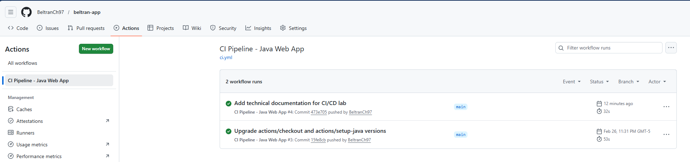
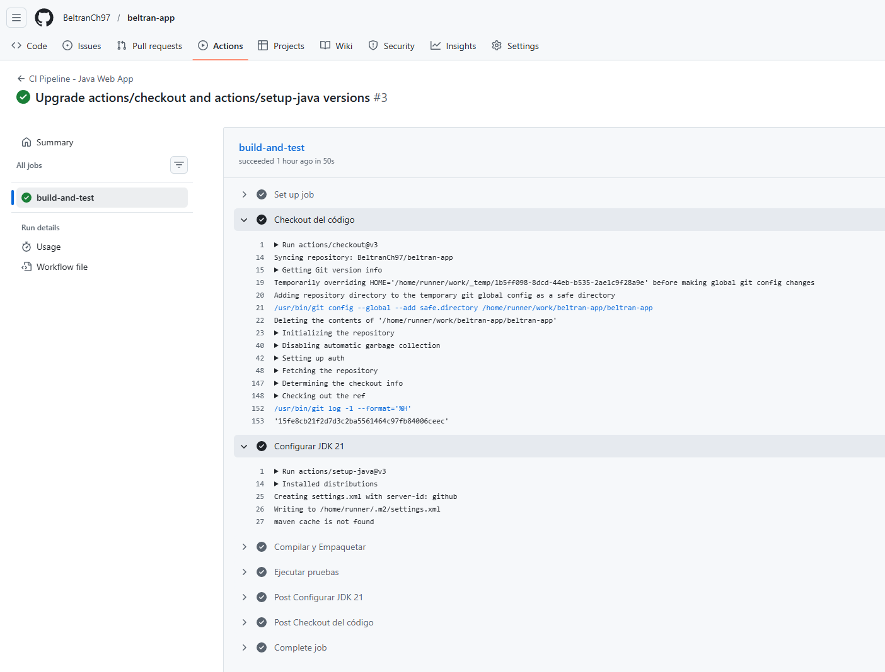
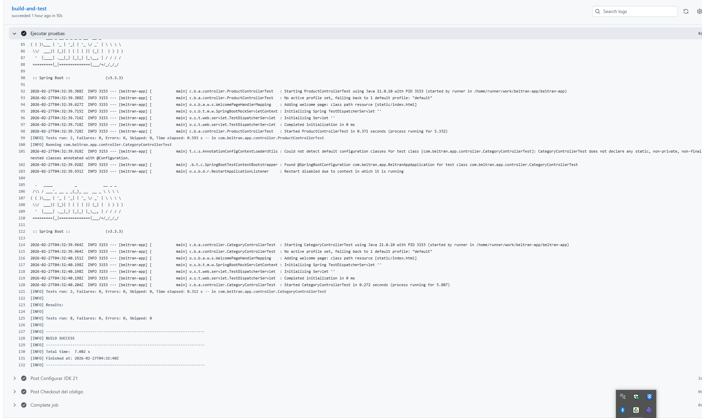
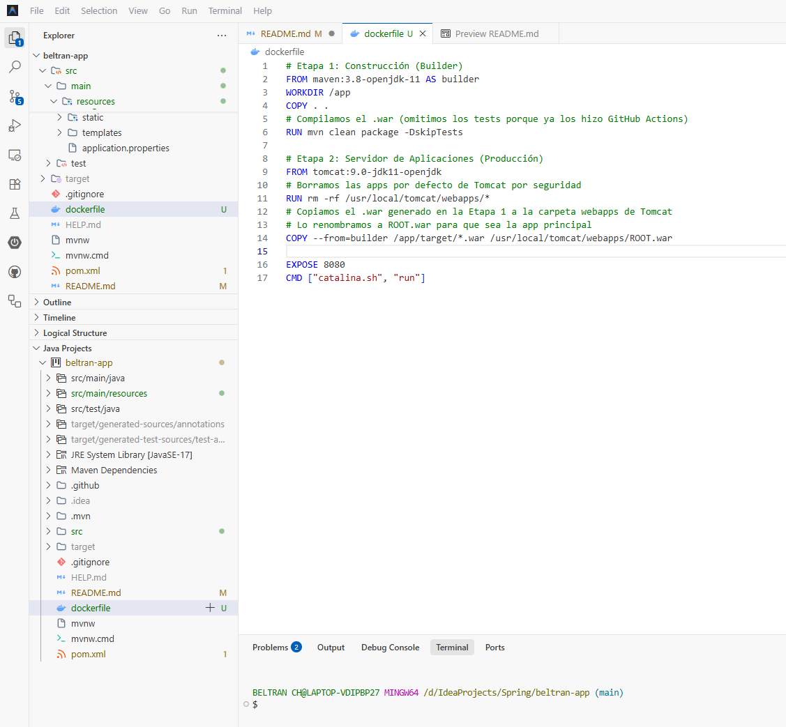

# Stockly: Sistema de Gestión de Inventario

**Stockly** es una plataforma web moderna para la gestión de inventarios, desarrollada en Java, que cuenta con una arquitectura DevOps orientada a entornos corporativos.

---

## 📚 Índice de Documentación
Para mantener un control formal y modular de la información, el repositorio distribuye su documentación técnica en los siguientes archivos clave:
- 📖 [**README.md**](./README.md): Documento principal, índice y visión general.
- ⚙️ [**Gestión de la Configuración del Software (SCM)**](./docs/SCM.md): Baselines, control de cambios, CIs y trazabilidad.
- 🚀 [**Pipeline CI/CD y Arquitectura**](./docs/CI_CD_PIPELINE.md): Justificación técnica, herramientas (Jenkins, GH Actions, Docker) y diagramas del pipeline.
- 📁 [**Propuesta de Estructura Wiki**](./docs/WIKI_PROPOSAL.md): Modelo propuesto para la migración de toda esta documentación a una Wiki de GitHub.

---

## 1. Visión General de la Arquitectura
Este repositorio aloja el código fuente y la definición de la infraestructura (IaC) de **Stockly**. La plataforma integra un diseño robusto de pipelines automatizados (CI/CD) para asegurar la calidad mediante análisis de código y pruebas continuas, y estandarizar el despliegue a través del empaquetado en contenedores Docker (Apache Tomcat) listos para orquestación en clústeres de Kubernetes.

## 2. Gestión de la Configuración del Software (Resumen SCM)
El proyecto **Stockly** adopta prácticas formales de SCM. Las políticas completas se encuentran en [**SCM.md**](./docs/SCM.md), pero destacan los siguientes pilares:
*   **Versionamiento y Baselines:** Se definen líneas base de Requisitos, Arquitectura, Funcional y de Despliegue, gestionadas mediante *tags* semánticos en Git.
*   **Control de Cambios:** Uso estricto de ramas (`feature/`, `bugfix/`) y Pull Requests con validación obligatoria automatizada (CI).
*   **Trazabilidad:** Conexión bidireccional desde el Issue en GitHub hasta el contenedor desplegado, referenciando commits y logs.

## 3. Arquitectura del Pipeline CI/CD (Resumen)
Se diseñó una arquitectura orientada a entornos corporativos:
1. **GitHub Actions (CI):** Ejecuta compilación (Java 21, Maven), pruebas unitarias, análisis de seguridad (Snyk, SonarCloud), empaqueta la imagen Docker y la sube a DockerHub.
2. **Jenkins & Kubernetes (CD):** Jenkins actúa como orquestador de la entrega continua, recogiendo manifiestos actualizados y desplegándolos sobre el clúster.

> *(Ver diagramas y configuración extensa en [**CI_CD_PIPELINE.md**](./docs/CI_CD_PIPELINE.md))*

---

## 4. Archivos de Configuración Core

### 4.1. Pipeline CI (GitHub Actions)
**Ruta:** `.github/workflows/ci.yml`

```yaml
name: CI Pipeline - Java Web App

on:
  push:
    branches: [ "develop", "master" ]
  pull_request:
    branches: [ "develop", "master" ]

jobs:
  build-and-test:
    runs-on: ubuntu-latest

    steps:
    - name: Checkout del código
      uses: actions/checkout@v3

    - name: Configurar JDK 21
      uses: actions/setup-java@v3
      with:
        java-version: '21'
        distribution: 'temurin' 
        cache: maven

    - name: Compilar y Empaquetar el artefacto (.war)
      run: mvn clean package

    - name: Ejecutar pruebas unitarias
      run: mvn test
```

### 4.2. Dockerfile
**Ruta:** `/`
```dockerfile
# Etapa 1: Construcción (Builder)
FROM maven:3.8-openjdk-11 AS builder
WORKDIR /app
COPY . .
RUN mvn clean package -DskipTests

# Etapa 2: Servidor de Aplicaciones (Producción)
FROM tomcat:9.0-jdk11-openjdk
RUN rm -rf /usr/local/tomcat/webapps/*
COPY --from=builder /app/target/*.war /usr/local/tomcat/webapps/ROOT.war
EXPOSE 8080
CMD ["catalina.sh", "run"]
```

### 4.3. Pipeline CD (Jenkins)
**Ruta:** `/Jenkinsfile`
```groovy
pipeline {
    agent any

    environment {
        DOCKER_IMAGE = 'mi-usuario/java-webapp-tomcat'
        DOCKER_TAG = 'latest'
        DOCKER_CREDS = credentials('dockerhub-credentials-id') 
    }

    stages {
        stage('1. Clonar el repositorio') {
            steps {
                echo 'Clonando repositorio de GitHub...'
                checkout scm
            }
        }

        stage('2. Construir imagen Docker') {
            steps {
                echo 'Construyendo imagen con Tomcat y el archivo .war...'
                sh "docker build -t ${DOCKER_IMAGE}:${DOCKER_TAG} ."
            }
        }

        stage('3. Publicar en DockerHub') {
            steps {
                echo 'Publicando la imagen de la Web App en el registro...'
                sh "echo \$DOCKER_CREDS_PSW | docker login -u \$DOCKER_CREDS_USR --password-stdin"
                sh "docker push ${DOCKER_IMAGE}:${DOCKER_TAG}"
            }
        }
    }
}
```

---

## 5. Evidencias de Ejecución
### 5.1. Pipeline CI (GitHub Actions)

---

---

---
### 5.2. Pipeline CD (Jenkins)


---

## 6. Resumen de Operaciones DevOps
La implementación de la arquitectura de Integración y Entrega Continua para **Stockly** demuestra un enfoque moderno en el ciclo de vida del desarrollo de software. Al automatizar la compilación con GitHub Actions y la estrategia de despliegue con Jenkins, se elimina el trabajo manual propenso a errores, garantizando la mantenibilidad, escalabilidad y la calidad del código, alineándose estrictamente con los estándares corporativos.
