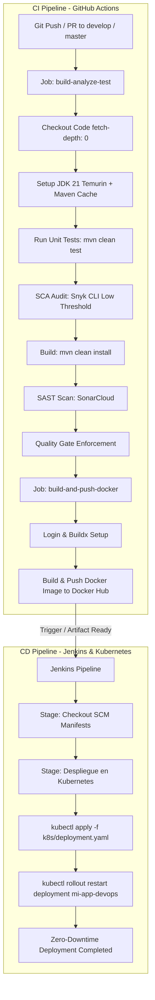

# Documentación Técnica: Pipeline CI/CD y DevOps

Este documento describe la arquitectura, flujo operativo, herramientas y gobernanza técnica para la implementación de **Integración Continua (CI)** y **Entrega / Despliegue Continuo (CD)** de la aplicación Java Spring Boot (`beltran-app` / `Stockly`).

---

## 1. Arquitectura y Descripción del Flujo CI/CD

El flujo de CI/CD automatiza de forma estricta el ciclo de vida del software desde la integración del código fuente en el repositorio hasta el despliegue en un clúster de Kubernetes, desacoplando la fase de **Integración Continua (CI)** en GitHub Actions de la fase de **Despliegue Continuo (CD)** en Jenkins.

---

## 2. Especificación Detallada del Pipeline de CI (GitHub Actions)

El workflow de Integración Continua está especificado en `.github/workflows/ci.yml` y reacciona a los eventos de `push` y `pull_request` sobre las ramas `develop` y `master`. Se divide en dos *jobs* secuenciales y dependientes:

### 2.1. Job 1: `build-analyze-test`
Ejecuta la verificación de calidad, seguridad y construcción en un entorno `ubuntu-latest`:

1. **Checkout del Código:** `actions/checkout@v4` con `fetch-depth: 0`, necesario para permitir un análisis completo de historial y blame en SonarCloud.
2. **Configuración del Entorno de Ejecución:** `actions/setup-java@v4` con **Java JDK 21** (distribución `temurin`) y habilitación de caché nativo de Maven (`cache: maven`) para optimizar los tiempos de ejecución.
3. **Verificación de Versiones:** Ejecución del comando `java -version` y `mvn -v` para auditar el entorno.
4. **Ejecución de Pruebas Unitarias:** Ejecución de `mvn clean test` para validar la lógica del software y garantizar la no regresión.
5. **Análisis de Vulnerabilidades en Dependencias (Snyk SCA):**
   - Descarga automatizada de la CLI de Snyk (`v1.1293.0`).
   - Ejecución de `./snyk test --severity-threshold=low --file=pom.xml` con el token `SNYK_TOKEN`.
   - Si se detectan vulnerabilidades conocidas (CVEs) con severidad baja o superior en las librerías de `pom.xml`, el pipeline se detiene inmediatamente.
6. **Compilación e Instalación Local:** Ejecución de `mvn clean install` para compilar las clases y generar los binarios en `target/classes`.
7. **Escaneo de Código Estático (SonarCloud SAST):** `SonarSource/sonarcloud-github-action@master` parametrizado con:
   - `-Dsonar.organization=beltranch97`
   - `-Dsonar.projectKey=BeltranCh97_beltran-app`
   - `-Dsonar.host.url=${{ secrets.SONAR_HOST_URL }}`
   - `-Dsonar.java.binaries=target/classes`
8. **Control de Puertas de Calidad (Quality Gate):** `SonarSource/sonarqube-quality-gate-action@v1` con un tiempo de espera de 5 minutos (`timeout-minutes: 5`). Evaluará si el código cumple los estándares mínimos de mantenibilidad, duplicación y bugs. Si la evaluación es negativa, el job falla.

### 2.2. Job 2: `build-and-push-docker`
Este job requiere explícitamente el éxito previo de `build-analyze-test` (`needs: build-analyze-test`). Garantizada la calidad y seguridad, procede al empaquetado del artefacto:

1. **Checkout del Código:** `actions/checkout@v4`.
2. **Autenticación en el Registry:** `docker/login-action@v3` utilizando los secretos `DOCKER_USERNAME` y `DOCKER_PASSWORD`.
3. **Configuración de Builder:** `docker/setup-buildx-action@v3` para habilitar capacidades avanzadas de construcción de imágenes.
4. **Construcción y Publicación de la Imagen:** `docker/build-push-action@v5`:
   - **Contexto y Dockerfile:** Utiliza el archivo `dockerfile` raíz (multi-stage build compilando con `maven:3.9.4-eclipse-temurin-21` y ejecutando con `eclipse-temurin:21-jre` sin privilegios de root via `appuser`).
   - **Publicación:** `push: true`.
   - **Etiquetado:** `${{ secrets.DOCKER_USERNAME }}/beltran-app:latest` enviando la imagen inmutable a Docker Hub.

---

## 3. Especificación Detallada del Pipeline de CD (Jenkins)

El pipeline de Entrega y Despliegue Continuo se define en el archivo `Jenkinsfile` y actúa como orquestador del despliegue hacia la infraestructura de Kubernetes:

### Stages del Pipeline en Jenkins

1. **Configuración de Entorno:**
   - `DOCKER_IMAGE`: Especifica la imagen objetivo (`beltranch97/beltran-app:latest`).
   - `KUBE_CRED_ID`: Credencial Kubeconfig registrada en Jenkins (`local-kubeconfig`).
2. **Stage 'Descargar Configuración':**
   - Ejecuta `checkout scm` para obtener los manifiestos de Kubernetes (`k8s/deployment.yaml`, `k8s/service.yaml`) directamente desde el repositorio Git, garantizando GitOps e infraestructura como código.
3. **Stage 'Despliegue en Kubernetes':**
   - Utiliza la directiva `withKubeConfig([credentialsId: "${KUBE_CRED_ID}"])`.
   - Aplica los manifiestos declarativos: `kubectl apply -f k8s/deployment.yaml`.
   - Ordena el reinicio secuencial del Deployment: `kubectl rollout restart deployment mi-app-devops`.
   - Esto fuerza a los Pods de Kubernetes a descargar la nueva imagen etiquetada como `latest` de Docker Hub con estrategia de actualización progresiva (Rolling Update) y cero tiempo de inactividad (Zero Downtime).

---

## 4. Herramientas Utilizadas y Justificación Técnica

| Herramienta | Fase DevOps | Justificación Técnica y Arquitectónica |
|---|---|---|
| **Git & GitHub** | SCM / Control de Versiones | Actúa como la **Única Fuente de la Verdad (SSOT)**. Proporciona protección de ramas, control de cambios mediante Pull Requests y disparadores de eventos para CI. |
| **Java JDK 21 & Maven** | Entorno de Ejecución & Build | **JDK 21 (Temurin)** aporta las últimas optimizaciones de rendimiento y LTS. Maven estandariza el empaquetado de la aplicación en un artefacto ejecutable Spring Boot `.jar`. |
| **Snyk CLI (v1.1293.0)** | DevSecOps (SCA) | Implementa la seguridad desplazada a la izquierda (*Shift-Left Security*), analizando `pom.xml` para interceptar vulnerabilidades conocidas (CVEs) antes de empaquetar el contenedor. |
| **SonarCloud** | Calidad de Código (SAST) | Inspecciona estáticamente el código fuente y aplica un **Quality Gate** estricto que previene la introducción de deuda técnica, errores de lógica o violaciones de mantenibilidad. |
| **Docker & Multi-Stage Build** | Empaquetado Impositivo | Estandariza la aplicación en un contenedor liviano basado en JRE 21. Ejecuta bajo un usuario sin privilegios (`appuser`), aislando el sistema de posibles vulnerabilidades a nivel de SO. |
| **Docker Hub** | Registry de Imágenes | Almacena y distribuye imágenes inmutables de la aplicación. Actúa como el contrato asíncrono que desacopla la fase de CI (GitHub) de la fase de CD (Jenkins). |
| **Jenkins** | Orquestación CD | Proporciona un entorno seguro para interactuar con el clúster de Kubernetes usando credenciales cifradas (`local-kubeconfig`) y scripts declarativos inmutables. |
| **Kubernetes (K8s)** | Plataforma de Ejecución / CD | Garantiza alta disponibilidad, auto-recuperación (self-healing), escalado declarativo y despliegues sin interrupción de servicio (`kubectl rollout restart`). |

---

## 5. Principios Arquitectónicos y Gobernanza DevOps

### 5.1. Seguridad Desplazada a la Izquierda (Shift-Left Security)
La seguridad no se pospone hasta la fase de operaciones. En el primer job del pipeline de CI (`build-analyze-test`), tanto Snyk como SonarCloud auditan el código y sus dependencias. Si cualquier control de seguridad o calidad falla, el pipeline aborta automáticamente la construcción, impidiendo que código inseguro llegue al Registro o a Producción.

### 5.2. Desacoplamiento Asíncrono mediante Registro Inmutable
GitHub Actions no realiza conexiones directas al clúster de producción. En su lugar, empaqueta y entrega un artefacto inmutable a Docker Hub (`beltranch97/beltran-app:latest`). Jenkins consume dicho artefacto de manera asíncrona, manteniendo un perímetro de red seguro y eliminando la necesidad de exponer credenciales de Kubernetes a GitHub Actions.

### 5.3. Principio DRY y Configuración Declarativa (GitOps / IaC)
- **Acciones Reutilizables:** Se aprovechan acciones probadas de la comunidad (`actions/checkout@v4`, `actions/setup-java@v4`, `docker/build-push-action@v5`).
- **Infraestructura como Código (IaC):** La configuración de Kubernetes (`k8s/deployment.yaml`, `k8s/service.yaml`) reside en el repositorio de código y se aplica de forma declarativa con `kubectl apply`.
- **Gestión Centralizada de Secretos:** Los tokens de autenticación se gestionan centralizadamente mediante GitHub Secrets y Jenkins Credentials, previniendo la filtración de claves en el código fuente.
