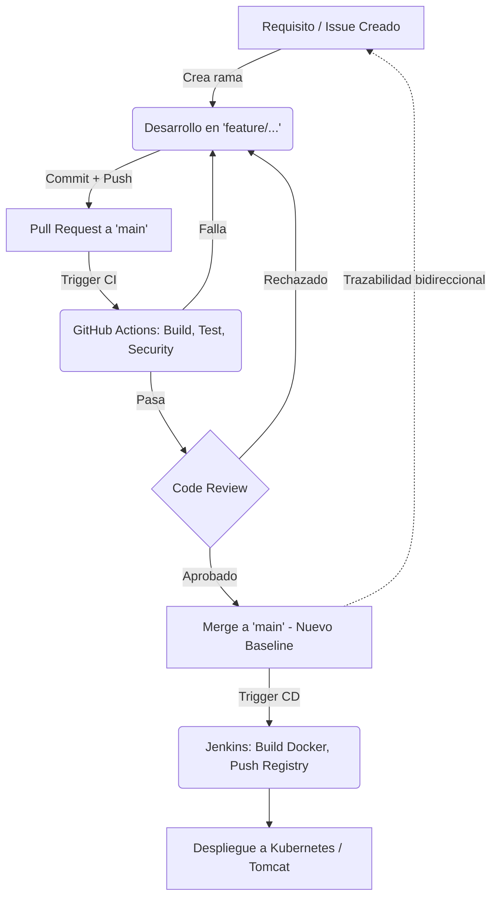

# Gestión de la Configuración del Software (SCM)

Para asegurar la integridad, trazabilidad y control de los cambios en el proyecto `Stockly`, se ha definido la siguiente estrategia de Gestión de Configuración del Software (SCM):

## 1. Identificación de Configuration Items (CIs)
Los Elementos de Configuración (CIs) representan los componentes clave del sistema que deben ser versionados y controlados. Para este proyecto, se identifican los siguientes:
*   **Código Fuente:** Todo el código Java ubicado en `src/`.
*   **Archivos de Construcción y Dependencias:** `pom.xml` (Maven).
*   **Infraestructura como Código (IaC) y Contenedores:** `dockerfile` y manifiestos en la carpeta `k8s/`.
*   **Pipelines CI/CD:** Archivo de GitHub Actions `.github/workflows/ci.yml` y orquestador `Jenkinsfile`.
*   **Documentación:** `README.md`, `CI_CD_PIPELINE.md` y este documento `SCM.md`.

## 2. Definición de Baselines del Sistema
Las líneas base (baselines) representan hitos críticos en el ciclo de vida del proyecto donde un conjunto de Elementos de Configuración (CIs) han sido revisados, aprobados y congelados. Cualquier cambio posterior a un baseline requiere un proceso de control de cambios formal. Se identifican las siguientes líneas base para `Stockly`:

### 2.1. Baseline de Requisitos (Requirements Baseline)
*   **Fase:** Inicio del proyecto o comienzo de un Sprint.
*   **Contenido:** Documentación de requerimientos, historias de usuario e issues creados y aprobados en GitHub.
*   **Propósito:** Establecer y congelar el alcance del trabajo antes de iniciar la codificación.
*   **Criterio de Aprobación:** Revisión y aceptación por parte del Product Owner o stakeholders, generando el backlog formal del proyecto.

### 2.2. Baseline de Arquitectura y Diseño (Design Baseline)
*   **Fase:** Previa a la implementación e integración de infraestructura.
*   **Contenido:** Documentos arquitectónicos (ej. `CI_CD_PIPELINE.md`), elección de tecnologías (Tomcat, Docker, Kubernetes) y diseño de pipelines.
*   **Propósito:** Asegurar que el diseño técnico es viable y cumple con los requerimientos funcionales y no funcionales.
*   **Criterio de Aprobación:** Revisión técnica (Peer Review) por parte del líder técnico o equipo DevOps.

### 2.3. Baseline Funcional (Developmental Baseline)
*   **Fase:** Finalización de la codificación y fase de Integración Continua (CI).
*   **Contenido:** Código fuente de la aplicación Java en `src/`, configuración de Maven (`pom.xml`) y código de pruebas.
*   **Propósito:** Garantizar que el código cumple con las funcionalidades solicitadas y tiene un alto nivel de calidad (ej. versión `v1.0.0`).
*   **Criterio de Aprobación:** Ejecución exitosa de GitHub Actions: compilación correcta, cobertura de pruebas unitarias al día, y análisis de seguridad limpio en SonarCloud/Snyk.

### 2.4. Baseline de Producto y Despliegue (Product Baseline)
*   **Fase:** Preparación para producción o pre-producción (Entrega Continua - CD).
*   **Contenido:** Artefacto compilado (`.war`), imagen Docker finalizada, manifiestos de Kubernetes (`k8s/`) y configuración de despliegue (`Jenkinsfile`).
*   **Propósito:** Consolidar absolutamente todos los elementos necesarios para desplegar y operar el sistema en un entorno real (ej. versión `v1.1.0`).
*   **Criterio de Aprobación:** Publicación exitosa de la imagen en DockerHub, superación de pruebas de humo y despliegue automatizado sin errores mediante Jenkins.

### 2.5. Gestión de Líneas Base (Versioning y Tagging)
Las líneas base se gestionan operativamente a través del control de versiones en Git:
*   **Tags Semánticos:** Se utiliza versionamiento semántico (SemVer: `MAJOR.MINOR.PATCH`). Por ejemplo, al aprobar un **Baseline de Producto**, se emite un release tag en el repositorio: `git tag -a v1.1.0 -m "Release v1.1.0 - Baseline de Despliegue"`.
*   **Inmutabilidad:** Una vez establecido un tag de versión, los CIs de esa foto exacta no deben alterarse. Si surge un fallo en producción, se genera una rama temporal de corrección (hotfix) que terminará en un parche subsecuente (ej. `v1.1.1`).

## 3. Estrategia de Control de Cambios
Cualquier modificación a un CI debe seguir un flujo controlado:
1.  **Solicitud:** Los cambios se solicitan mediante la creación de un *Issue* en GitHub.
2.  **Desarrollo:** Se crea una rama a partir de `main` siguiendo la convención de nombres: `feature/nombre-funcionalidad`, `bugfix/nombre-error` o `hotfix/nombre-critico`.
3.  **Revisión (Pull Request):** Al finalizar el desarrollo, se crea un *Pull Request (PR)* hacia la rama `main`.
4.  **Validación Automática:** El PR dispara el pipeline de CI (GitHub Actions) que compila y ejecuta pruebas. El PR no puede fusionarse si las verificaciones fallan.
5.  **Aprobación:** Requiere revisión de código (*Code Review*) por parte de al menos otro desarrollador o responsable técnico.
6.  **Fusión (Merge) y Despliegue:** Una vez aprobado y con verificaciones exitosas, se realiza el *merge* a `main`. Esto desencadena los despliegues correspondientes (CD).

## 4. Mecanismos de Trazabilidad
Para garantizar el seguimiento bidireccional desde los requisitos hasta el código desplegado:
*   **Commits y PRs vinculados a Issues:** Todo commit debe hacer referencia al ID del *Issue* de trabajo (ej. `git commit -m "Fix #12: Corrige vulnerabilidad de dependencias"`).
*   **Etiquetado en Docker:** Las imágenes Docker generadas llevarán un tag semántico o referenciado al commit, además de `latest`, permitiendo saber con exactitud la versión del código contenida.
*   **Logs y Artefactos:** Los pipelines de CI/CD mantienen logs históricos de ejecución y generación de artefactos que enlazan directamente con la versión de código evaluada.

## 5. Modelo de la Estrategia de Gestión de la Configuración
El siguiente diagrama resume el flujo SCM implementado en el ecosistema del proyecto:

