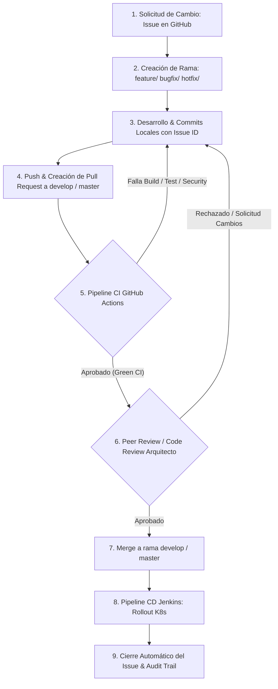

# Plan de Gestión de la Configuración del Software (SCM) - Estándar IEEE 828

Para asegurar la integridad, trazabilidad, calidad y control formal de los cambios en el proyecto **Stockly** (`beltran-app`), se ha definido el presente Plan de Gestión de Configuración del Software (SCM), estructurado conforme al estándar **IEEE 828** (Standard for Configuration Management in Systems and Software Engineering) y bajo la dirección del rol de **Arquitecto de Software**.

---

## 1. Introducción y Propósito

El propósito de este documento es definir las políticas, actividades, herramientas y responsabilidades para la gestión sistemática de los Elementos de Configuración (Configuration Items - CIs) a lo largo del ciclo de vida del desarrollo del software.

El alcance abarca desde la captura de requisitos e historias de usuario en GitHub, la codificación en Java 21 / Spring Boot, la automatización de análisis de seguridad y calidad en pipelines de Integración Continua (GitHub Actions), el empaquetado en imágenes inmutables de Docker, hasta el despliegue orquestado en entornos de Kubernetes (Jenkins CD).

---

## 2. Organización, Roles y Responsabilidades SCM

La gestión de configuración involucra múltiples roles interdisciplinarios dentro del equipo de ingeniería:

| Rol SCM | Responsabilidades Principales | Herramientas |
|---|---|---|
| **Arquitecto de Software** | Define la estrategia SCM y la taxonomía de CIs. Establece las líneas base (baselines), aprueba cambios arquitectónicos y supervisa la gobernanza del código y la infraestructura. | Git, GitHub, SonarCloud, Snyk |
| **Ingenieros de Software / Desarrolladores** | Implementan funcionalidades y correcciones en ramas aisladas. Crean Pull Requests, escriben pruebas unitarias y garantizan el cumplimiento de los estándares de código. | Git, Java JDK 21, Maven, IDE |
| **Ingeniero DevOps / Release Manager** | Administra los pipelines CI/CD (GitHub Actions y Jenkins), gestiona el Registro de Contenedores (Docker Hub), custodia las credenciales/secretos y coordina los despliegues a Kubernetes. | GitHub Actions, Jenkins, Docker, K8s |
| **Product Owner / Comité de Control de Cambios (CCB)** | Aprueba requisitos, prioriza el backlog del proyecto, revisa las entregas en la Baseline de Producto y autoriza la liberación formal a producción. | GitHub Issues / Projects |

---

## 3. Identificación de Elementos de Configuración (Configuration Items - CIs)

Los Elementos de Configuración (CIs) representan los componentes tangibles del sistema que deben ser identificados, versionados, rastreados y controlados de forma individual o agrupada. 

Para el proyecto `Stockly` / `beltran-app`, se establece la siguiente taxonomía y catálogo de CIs:

### Categoría y Matriz de CIs

| ID CI | Categoría / Nombre CI | Ubicación / Elemento | Descripción Técnica | Esquema de Versionamiento | Baseline Asociada |
|---|---|---|---|---|---|
| **CI-SRC-001** | Código Fuente de Aplicación | `src/main/java/` | Código Java Spring Boot (Controladores, Servicios, Repositorios, Entidades). | SemVer / Git Commit Hash | Developmental / Product |
| **CI-TST-001** | Pruebas de Software | `src/test/java/` | Pruebas unitarias e integración con JUnit 5 y Spring Boot Test. | Git Commit Hash | Developmental |
| **CI-BLD-001** | Descriptor de Construcción | `pom.xml`, `mvnw`, `mvnw.cmd`, `.mvn/` | Configuración de dependencias Maven, plugins y propiedades de JDK 21. | SemVer (`pom.xml`) / Git | Design / Developmental |
| **CI-IAC-001** | Definición de Contenedor | `dockerfile` | Script multi-stage build para empaquetado inmutable en Temurin 21 JRE. | Git Commit Hash | Product / Release |
| **CI-IAC-002** | Manifiestos de Infraestructura | `k8s/deployment.yaml`, `k8s/service.yaml` | Especificación declarativa de Workloads y Services de Kubernetes. | Git Commit Hash | Product / Release |
| **CI-PIP-001** | Pipeline de CI | `.github/workflows/ci.yml` | Workflow de GitHub Actions para Build, Test, Snyk, SonarCloud y Docker Push. | Git Commit Hash | Design / Product |
| **CI-PIP-002** | Pipeline de CD | `Jenkinsfile` | Pipeline declarativo de Jenkins para sincronización SCM y rollout en Kubernetes. | Git Commit Hash | Design / Product |
| **CI-DOC-001** | Documentación de Arquitectura | `docs/SCM.md`, `docs/CI_CD_PIPELINE.md`, `docs/WIKI_PROPOSAL.md` | Modelos de SCM (IEEE 828), especificación de CI/CD y propuestas wiki. | Git Commit Hash | Requirements / Design |
| **CI-DOC-002** | Documentación General | `README.md` | Guía general del proyecto, arquitectura de alto nivel e instrucciones. | Git Commit Hash | Requirements / Design |
| **CI-CFG-001** | Control de Exclusiones Git | `.gitignore` | Reglas de exclusión de artefactos temporales y binarios en el repositorio. | Git Commit Hash | Design |

---

## 4. Definición de Líneas Base del Sistema (Baselines)

Una **Línea Base (Baseline)** es una especificación o producto que ha sido formalmente revisado y acordado, y que sirve como base para desarrollos posteriores, pudiendo modificarse únicamente mediante un proceso formal de control de cambios.

### 4.1. Baseline de Requisitos (Requirements Baseline)
*   **Fase:** Fase Inicial / Comienzo de Sprint.
*   **CIs Incluidos:** `CI-DOC-002` (`README.md`), GitHub Issues y Backlog.
*   **Propósito:** Definir el alcance funcional y técnico congelado para la iteración.
*   **Criterio de Aprobación:** Revisión y aceptación por el Product Owner en GitHub.

### 4.2. Baseline de Arquitectura y Diseño (Design Baseline)
*   **Fase:** Fase de Diseño Arquitectónico y DevOps.
*   **CIs Incluidos:** `CI-DOC-001` (`SCM.md`, `CI_CD_PIPELINE.md`), `CI-BLD-001` (`pom.xml`), `CI-PIP-001`, `CI-PIP-002`.
*   **Propósito:** Validar la viabilidad de la pila tecnológica (Java 21, Spring Boot, Docker, Kubernetes, Jenkins, GitHub Actions).
*   **Criterio de Aprobación:** Peer Review aprobada por el Arquitecto de Software.

### 4.3. Baseline Funcional (Developmental Baseline)
*   **Fase:** Fase de Integración Continua (CI).
*   **CIs Incluidos:** `CI-SRC-001`, `CI-TST-001`, `CI-BLD-001`.
*   **Propósito:** Garantizar que el código fuente compila, pasa las pruebas unitarias y cumple con los estándares de calidad y seguridad.
*   **Criterio de Aprobación:** Ejecución exitosa de GitHub Actions: `mvn clean test` sin fallos, escaneo de Snyk limpio en dependencias y SonarCloud Quality Gate aprobado (`PASSED`).

### 4.4. Baseline de Producto y Despliegue (Product / Release Baseline)
*   **Fase:** Entrega y Despliegue Continuo (CD).
*   **CIs Incluidos:** Artefacto JAR compilado, Imagen Docker etiquetada en Docker Hub (`CI-IAC-001`), Manifiestos de Kubernetes (`CI-IAC-002`), `Jenkinsfile` (`CI-PIP-002`).
*   **Propósito:** Consolidar el paquete inmutable listo para operar en el clúster de producción.
*   **Criterio de Aprobación:** Construcción y publicación exitosa de la imagen en Docker Hub, rollout exitoso en Kubernetes mediante Jenkins y validación de pruebas de humo.

### 4.5. Versionamiento Semántico (SemVer) e Inmutabilidad
*   **SemVer (`MAJOR.MINOR.PATCH`):** Se aplica tanto en `pom.xml` como en las etiquetas Git.
    *   `MAJOR`: Cambios incompatibles en la API o arquitectura.
    *   `MINOR`: Nuevas funcionalidades compatibles hacia atrás.
    *   `PATCH`: Corrección de errores (bugfixes/hotfixes) compatibles.
*   **Inmutabilidad:** Las versiones etiquetadas (ej. `git tag -a v1.0.0 -m "Baseline v1.0.0"`) son inalterables. Todo ajuste posterior requiere un nuevo commit y parche (ej. `v1.0.1`).

---

## 5. Estrategia de Control de Cambios (Configuration Control)

El control de cambios garantiza que ninguna modificación a un CI se realice sin trazabilidad, análisis de impacto y aprobaciones correspondientes.

### Reglas de Ramificación y Commits
1.  **Ramificación:** Las ramas `master` y `develop` están protegidas. Se prohíbe el push directo. Todo trabajo se realiza en ramas secundarias: `feature/funcionalidad`, `bugfix/correccion`, `hotfix/incidencia-critica`.
2.  **Mensajes de Commit:** Deben incluir el ID del Issue correspondiente para trazabilidad: `git commit -m "Fix #42: Corregir validación de datos en controlador REST"`.
3.  **Pull Request (PR):** Requiere obligatoriamente:
    - Paso exitoso del pipeline de GitHub Actions (Build, Pruebas Unitarias, Snyk, SonarCloud Quality Gate).
    - Aprobación de al menos un revisor (Peer Review / Arquitecto de Software).

---

## 6. Contabilidad del Estado de la Configuración (Configuration Status Accounting - CSA)

La Contabilidad del Estado permite conocer en todo momento el estado actual, histórico y cambios realizados en cada CI.

### Matriz de Trazabilidad Bidireccional
Se garantiza el rastreo de extremo a extremo:
$$\text{Requisito (Issue ID)} \iff \text{Rama / Commit SHA} \iff \text{Pull Request} \iff \text{Build CI} \iff \text{Docker Digest} \iff \text{Despliegue K8s}$$

*   **Identificación en Contenedores:** Cada imagen Docker generada lleva etiquetas asociadas al commit de Git y versión semántica, además del tag `:latest` para despliegue operativo.
*   **Registros de Auditoría (Audit Logs):** GitHub Actions y Jenkins conservan el historial inmutable de cada compilación, reporte de prueba, análisis de seguridad y log de despliegue.

---

## 7. Auditorías y Revisiones de la Configuración (Configuration Audits)

Las auditorías confirman que el producto cumple con los requisitos especificados (FCA) y que los CIs entregados concuerdan con la documentación y estructura física (PCA).

### 7.1. Auditoría de Configuración Funcional (FCA - Functional Configuration Audit)
*   **Objetivo:** Verificar que el software ha superado todas las pruebas funcionales y requisitos de calidad antes de la liberación.
*   **Mecanismo:** Automatizado en CI mediante `mvn clean test` y el Quality Gate de SonarCloud. Si la cobertura o las métricas de mantenibilidad no cumplen los umbrales predefinidos, la FCA se considera fallida y se bloquea la integración.

### 7.2. Auditoría de Configuración Física (PCA - Physical Configuration Audit)
*   **Objetivo:** Verificar que los artefactos generados (JAR, Docker Image, Manifiestos K8s) coinciden exactamente con la versión del código fuente y especificaciones de construcción.
*   **Mecanismo:** Validación del `dockerfile` multi-stage build y confrontación de hashes y versiones entre `pom.xml`, el artefacto Java compilado y los manifiestos de Kubernetes (`deployment.yaml`).

### 7.3. Auditoría de Seguridad de la Configuración (Shift-Left Security Audit)
*   **Objetivo:** Identificar vulnerabilidades conocidas (CVEs) en las dependencias antes de empaquetar la aplicación.
*   **Mecanismo:** Ejecución de **Snyk CLI** (`--severity-threshold=low`) sobre `pom.xml` en el workflow de CI.

---

## 8. Gestión de Entregas y Despliegue (Release Management & Delivery)

1.  **Empaquetado Inmutable:** El código Java 21 se compila y empaqueta en un archivo `.jar` dentro de una imagen Docker basada en `eclipse-temurin:21-jre`.
2.  **Publicación en Registro:** La imagen es empujada al registro centralizado **Docker Hub** (`beltranch97/beltran-app:latest`).
3.  **Despliegue Declarativo en Kubernetes:** Jenkins ejecuta los manifiestos `k8s/deployment.yaml` y `k8s/service.yaml`, seguido de un comando `kubectl rollout restart deployment mi-app-devops`, garantizando una actualización progresiva y sin tiempo de inactividad (Zero Downtime).

---

## 9. Herramientas, Entorno y Recuperación ante Desastres

### 9.1. Inventario de Herramientas SCM

| Herramienta | Función en SCM | Estándar / Versión |
|---|---|---|
| **Git & GitHub** | Control de Versiones Distribuido y Control de Cambios | Git 2.x / GitHub Cloud |
| **Java JDK & Maven** | Entorno de Desarrollo y Gestor de Dependencias | JDK 21 (Temurin) / Maven 3.9.x |
| **Snyk CLI** | Auditoría SCA y Seguridad de Dependencias | v1.1293.0 |
| **SonarCloud** | Análisis SAST y Quality Gate de Calidad | SonarSource GitHub Action |
| **Docker & Docker Hub** | Contenerización e Inmutabilidad de Artefactos | Docker Buildx / Docker Hub |
| **Jenkins & Kubernetes** | Orquestación CD y Entorno de Ejecución | Jenkins Pipeline / K8s Cluster |

### 9.2. Gestión de Secretos y Seguridad
*   Todas las credenciales sensibles (`SNYK_TOKEN`, `SONAR_TOKEN`, `DOCKER_USERNAME`, `DOCKER_PASSWORD`, `SONAR_HOST_URL`) se custodian en **GitHub Secrets**.
*   Las credenciales de acceso a Kubernetes (`KUBE_CRED_ID`) son administradas de forma segura por el gestor de credenciales de **Jenkins**.

### 9.3. Recuperación ante Desastres (Disaster Recovery & Backup)
*   **Código como Fuente Única de Verdad (Single Source of Truth):** Debido a que la infraestructura (`k8s/`), contenedores (`dockerfile`), y pipelines (`ci.yml`, `Jenkinsfile`) están versionados como código (IaC y PaC), cualquier entorno puede ser reconstruido desde cero a partir de una clonación limpia del repositorio Git.
